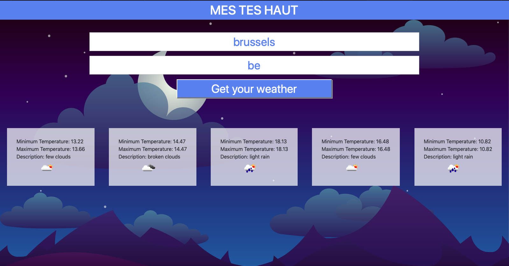

# Appli météo

Mon premier projet utilisant vue.js et les API

## Description :

Un site pour obtenir la météo, sur 5 jours, dans toutes les villes du monde

## Date :

Réalisé entre le 2 et le 5 mars 2019, en tant que stagiaire @ BeCode

## Par

+ Mona Marchetti
+ Dorian Vanderheyden

## Langages utilisés :

+ HTML
+ CSS
+ JAVASCRIPT

## Framework utilisé :

+ vue.js
+ Bootstrap

## API utilisée :

Lien vers l'API d'openweathermap : <https://openweathermap.org/api>

## Progression :

Projet terminé

## Liens utiles :

Lien vers les consignes : <https://github.com/becodeorg/BXL-Johnson-3.9/tree/master/Projets/Mets-Tes-Hauts>

Lien vers la github page : <https://dorianbec.github.io/mes-tes-haut/>

Lien vers les mock-up figma : <https://www.figma.com/file/WgaQ2gbEZWpum2ETClKYOqkZ/mockUp01?node-id=5%3A3>

## Aperçu du site :

## Crédits photos :

Les illustrations proviennent du site   

Illustratrice: Wild0ne : <https://pixabay.com/users/wild0ne-920941/>

